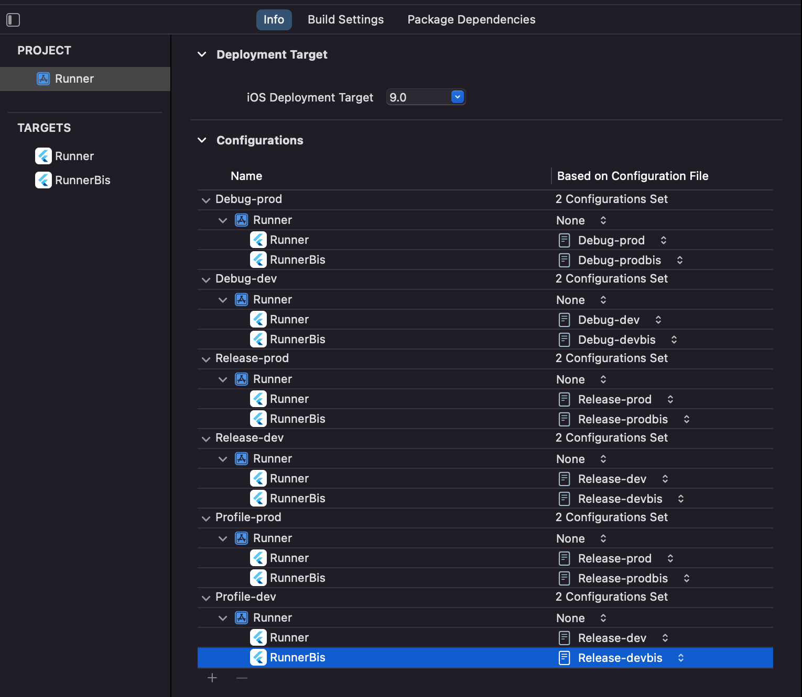
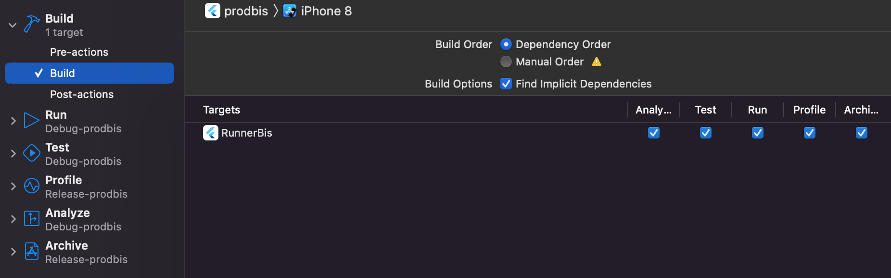
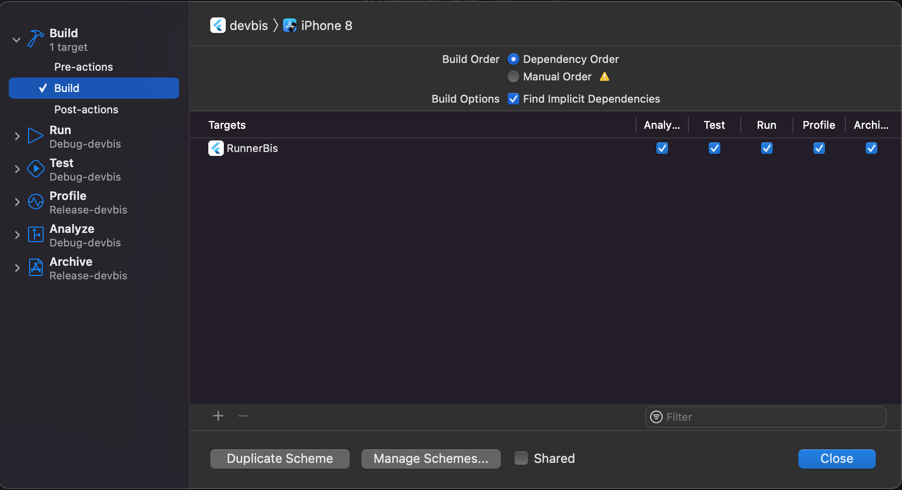
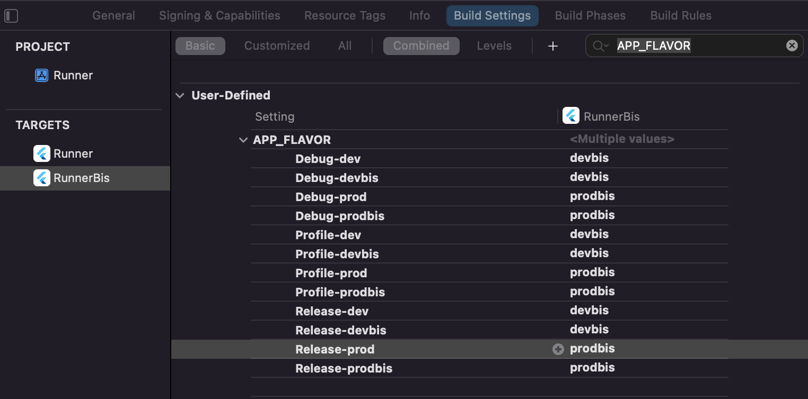
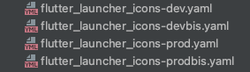
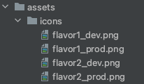
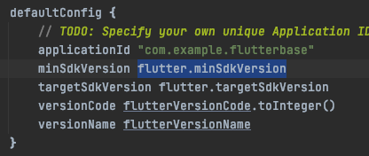
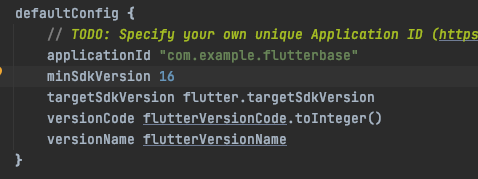
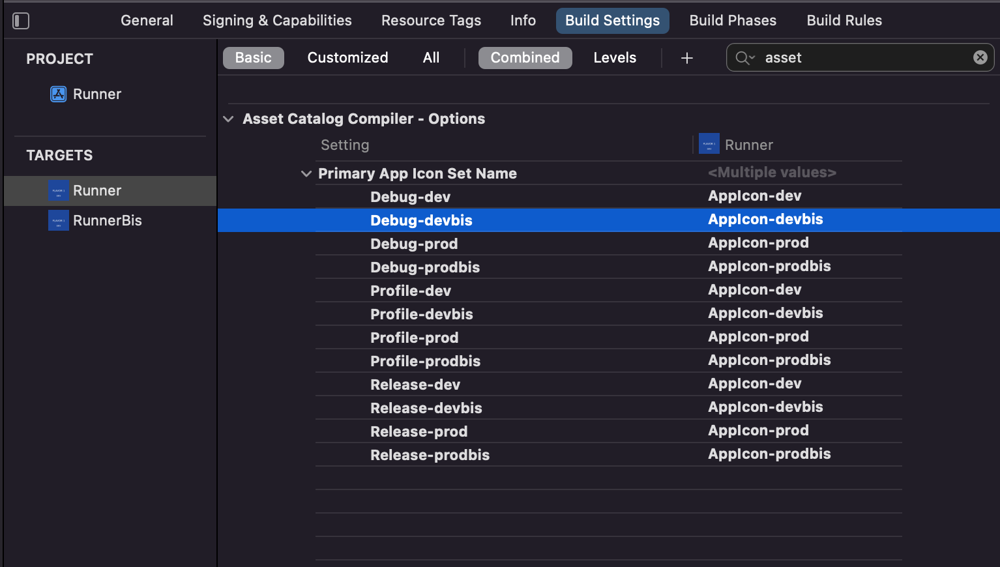

# flutter_base

Flutter base for any Flutter project.

## Getting Started

This project has 2 apps (white label friendly) with 2 flavors each:

- dev - prod - devbis - prodbis

To launch the project run the following

```
flutter run --flavor dev
flutter run --flavor prod
```

## Flavor doc

Links used to add app and flavors to project

- https://blog.svenadolph.net/flutter-flavors-and-ios-schemes/
- https://www.chwe.at/2020/10/flutter-flavors/
- for icons : https://dev.to/stack-labs/flutter-flavors-launcher-icons-made-simple-336j

On Android we used kotlin flavors and on iOS we used schemes and targets.

### Flavor variables

Flavors can be used to create different apps. It can also be used to define app variables with
different value for each of these apps.

The principle is to define variables on native side and access it from Flutter side.

#### Adding variable : Android

You have to open the ```app/build.gradle``` file and add a line in each flavor as following:

```
resValue "VAR_TYPE", "VAR_KEY", "VAR_VALUE"
```

You can check this project to see the example with the variable ```apiUrl```. That's all for
Android.

You can also check the ```MainActivity.kt``` to see how the native channel is built.

#### Adding variable : iOS

1. Edit each ```xcconfigs``` file in ```iOS/Flutter``` to add a new variable with a value according
   to the linked flavor (config variable named ```api_Url``` in our example).

2. In xCode, edit each ```plist``` files (one per target) by adding a key (here ```apiUrl``` ), a
   type and a value. Here we get the value from ```xcconfig``` files.



You can check the association between Target and config by going to ```Build Settings``` tab
and ```User-Defined``` section. You should see the variable from ```xcconfig``` files (```api_url```
in our example) and its value for each config.

All new variables need to be added under the ```App - Values``` in ```plist``` files to be reachable
from flutter by the native channel we created. Check ```AppDelegate.swift``` to see how the native
channel is built.

#### Using native values from Flutter

In each Android and iOS project, we created a channel named ```appValues```. From it, we can call
method as variable name (here ```apiUrl``` ).

With this we just need to create a method that call this channel with the method (variable name) to
get the value of interest. You can check the channel helper create in ```lib/core/helpers```.

### Adding new app

Here we presents all steps to add a new working app to the project.

#### Android side

Go to ```android/app/build.gradle``` and add flavors of the new app below existing ones like :

```
devbisbis {
    dimension "app"
    applicationId "com.example.flutterbasebisbis"
    applicationIdSuffix ".dev"
    versionNameSuffix "-dev"
    resValue "string", "app_name", "Flavor3 Dev"
}

prodbisbis {
    dimension "app"
    applicationId "com.example.flutterbasebisbis"
    resValue "string", "app_name", "Flavor3"
}
```

#### iOS side

Here it's more complicated as we need to follow more steps.

1. Edit the Podfile (ios folder) to add the target of the new app (needed for pods) below existing
   targets. Add the following lines:

```
target 'RunnerBisBis' do
  use_frameworks!
  use_modular_headers!

  flutter_install_all_ios_pods File.dirname(File.realpath(__FILE__))
end
```

2. in Xcode, add a new target by duplicating an existing ones (ie RunnerBisBis) (we will edit it
   latter)

3. in Xcode, go to the Flutter folder and duplicate ```xconfig``` files to have the following:

```
Debug-devbisbis.xcconfig
Debug-prodbisbis.xcconfig
Release-devbisbis.xcconfig
Release-prodbisbis.xcconfig
```

Edit the content of the file to match what you want (app name only currently and dev bundle suffix).
Config file names have to match the name of the flavor to allow Flutter to access it correctly.
Ensure that these new files are linked to the new target.

4. in Xcode, select ```Runner``` project, in PROJECT select again ```Runner``` and select ```Info```
   tab. No you can duplicate existing```Configurations``` to create 6 new configurations as
   following:

```
Debug-devbisbis
Debug-prodbisbis
Release-devbisbis
Release-prodbisbis
Profile-devbisbis
Profile-prodbisbis
```

Now ensure that for each new configuration, each target is linked to the correct xcconfig as
following:


5.Now we need to edit schemes. Rename the scheme linked to the new target as ```prodbisbis``` (or
another one according to what you selected before for prod flavor). Ensure that the scheme is linked
to the correct target and and correct configurations



6. Now duplicate the previous scheme to create the dev scheme of the app and named
   it ```devbisbis``` (or another one according to what you selected before for prod flavor)
   Ensure again that the scheme in linked correctly to target and configs



7. Now you can edit the bundle id of the new app. In Xcode, select ```Runner``` project, in TARGETS
   select the new target and select ```Build Settings```tab. Do a research of ```bundle```
   In ```Packaging``` open ```Product Bundle Identifier``` and edit the value for each
   configuration.

8. To Allow Flutter to know the flavor within the app, you need to specify it in Xcode.
   Select ```Runner``` project, in TARGETS select the new target and select ```Build Settings```tab.
   Do a research of ```APP_FLAVOR```
   For each configuration, specify the name of the flavor (attention to dev and prod) as following:



### Adding icons to new app

For this part we used the flutter
plugins [flutter_launcher_icons](https://pub.dev/packages/flutter_launcher_icons) and
this [website](https://dev.to/stack-labs/flutter-flavors-launcher-icons-made-simple-336j).

1. After adding this plugin in dev dependencies, create specific files as following (according to
   flavor name):



Inspire yourself from the existing file in the project.

2. Create png files with dimensions 1024 x 1024 pixels in the asset folder as following:



3. For android there is a little bug that can be fixed easily and temporary for the icon creation.
   Change just this lines in ```android/app/build.gradle```

<p float="left">
   
   
</p>

4. Run the following command:

```
flutter pub run flutter_launcher_icons:main -f flutter_launcher_icons*
```

This will generate all files for android and iOS.

5. For iOS you need to check that icons are linked to the correct configuration. In Xcode,
   select ```Runner``` project, in TARGETS select the new target and select ```Build Settings```tab.
   Do a research of ```asset```. For each target, check all association between config and icon. See
   the following example:



6. Revert change on the file ```android/app/build.gradle```