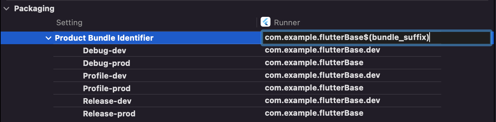

# Flutter Base

This project aimed to be the base of any new Flutter porject.

Base is build on:
- flutter bloc
- clean architecture

You can run the app using this two commands:
```
flutter run --flavor dev
flutter run --flavor prod
```

This project use fvm to handle flutter version.
So use ```fvm flutter``` command instead of ```flutter``` when cleaning, adding plugins, build, etc.

## Clean architecture

This project is built with clean architecture.


Each feature has a structure as follow:
```
|-- data
|   |-- datasources
|   |   |-- exemple.remote_datasource.dart
|   |   `-- example.remote_datasource.impl.dart
|   |-- models
|   |   `-- example.model.dart
|   `-- repositories
|       `-- example.repository.impl.dart
|-- domain
|   |-- entities
|   |   `-- example.entity.dart
|   |-- repositories
|   |   `-- example.repository.dart
|   `-- use_cases
|       |-- example.use_case.dart
`-- presentation
    `-- cubits
        |-- example.cubit.dart
        `-- example.state.dart
    `-- pages
        `-- example.page.dart
    `-- widgets
        `-- example.widget.dart
```

### Data sources

In this part we have:
- ```models``` : used to construct class instance from any source and usable by dart code + extends an entity
- ```remote data sources (interface/impl)``` : used to get data from any sources (remote, local etc)
- ```repository (impl)``` : used to get that and handle any response case (failure or success)

### Domain
In this part we have:
- ```entity``` : class instance holding data used every where in the app, can contain specific functions
- ```repository``` (interface) : interface for feature repository
- ```use case``` : used to do a single task related to a repository (can only call execute method)

### Presentation
In this part we have:
- ```cubit``` : used to do any business logic call
- ```page``` : any page linked to the feature
- ```widget``` : any widget used in any page of the feature

## Android fix

There's a little bug starting with flutter ```3.7.1``` linked to android build, see [solution here](https://stackoverflow.com/a/75320787).

We needed to change gradle version from 7.5 to 7.6 in ```android/graddle/wrapper/gradle-wrapper.properties```.

## Generated files

In this app we use [get_it](https://pub.dev/packages/get_it) combined with [injectable](https://pub.dev/packages/injectable) and [injectable_generator](https://pub.dev/packages/injectable_generator) to handle dependencies injection.

Files concerned by dependencies injection:
- singleton (classes with injectable @singleton tag)

To generate the dependencies injection file, run this command each time changes are made:
```
fvm flutter packages pub run build_runner build --delete-conflicting-outputs
```

It will generate a file called ```get_it.injector.config.dart``` in the ```\lib``` directory.

## Localization

For localization, the following link was used:

https://docs.flutter.dev/development/accessibility-and-localization/internationalization

In this app, localization is handled by using a custom LocalizationCubit (see [state management](#state-management-with-cubit) part).

This way we can update MaterialApp locale (case with context) and [ConfigHolder](#app-config) locale (case without context).

## App config

All info needed at the start of the app is loaded from native side and store in a ```ConfigHolder```.

This holder is a singleton that can be reached from anywhere in the app, and is defined in ````/lib/core/config````.

It can store info like flavor key, api base url, and other.

It also store the current locale if its needed where context of the app is not reachable.

## State management with Cubit

In this app, ```BLoC``` (Business Logic Component) pattern is used as state management via [flutter_bloc](https://pub.dev/packages/flutter_bloc) which extends it.

This pattern aim to extract logic from UI by defining it in a component called ```Cubit``` (or Bloc in the original pattern). See how Cubit works:


Each Cubit have a state (containing or not data) that will change over time.
UI can listen to this changes and adapt according to current state.
So we can say that ```UI = f (state)```.

When creating a Cubit, you can differentiate two different type:
- ```storage```: load and store some data (ex: get a list of assets)
- ```treatment```: perform an action and give the result to another cubit (ex: add a new asset to the list and get the updated list)

Each type can have multiple states:
- ```loading```: action is not finished
- ```loaded```: action is finished and data is stored
- ```error```: action is finished and error is stored


For each cubit, there is two files linked to it:
- ```example.cubit.state.dart```: containing custom states of this cubit
- ```example.cubit.dart```: defining the cubit and its behavior

## Flavors

This project consider two flavors running on both android ans iOS side: 
- ```dev```
- ```prod```

Each flavor is defined by its name and some customizable values:
- ```api url``` : to get api base url from native conf
- ```app name``` : to specify app display name
- ```bundle suffix``` : to differentiate dev and prod app

Useful links:
- https://www.chwe.at/2020/10/flutter-flavors/
- https://blog.svenadolph.net/flutter-flavors-and-ios-schemes/

### Android

1) Flavors declaration
The ```android/app/build.gradle``` was edited to add dev and prod flavors with their config values.

2) Channels
```MainActivity.kt``` was edited to add channels and method to retrieve value from native on Flutter side.

3) Application
```AndroidManifest.xml``` was edited to define app name according to selected flavor.

### iOS

For iOS platform it's a bit more complex to add flavor because iOS works with schemes.

1) Create Release and Debug config files via Xcode in ```ios/Flutter```

2) Create configurations Debug/Release/Profile in Runner (Project part in Xcode)


3) Create dev and prod schemes that use linked configurations defined before

Don't forget to set scheme to shared and they must have the same name than flavors.

5) Check ```User-Defined``` values in ```Targets``` => ```Runner``` => ```Build Settings``` => ```User-defined```

Here you should see some values (```api_url```, ```app_name```, ```bundle_suffix```) based on configurations.

5) Add a ```User-Defined``` named ```app_flavor``` to store flavor value for each configurations


6) Add entries to ```Info.plist``` in Xcode:
- ```App - values``` as a dictionary with key ```api_url``` linked to ```$(api_url)```
- ```App - flavor``` as a String with value ```$(api_flavor)```


7) Edit ```Bundle display name``` in ```Info.plist``` to value ```$(app_name)```

8) Channels
```AppDelegate.swift``` was edited to add channels and method to retrieve value from native on Flutter side.

9) Edit bundle suffix
- go to ```Targets``` => ```Runner``` => ```Build Settings``` => ```Packaging``` => ```Product Bundle Identifier```
- set general value to ```com.your.bundle(bundle_suffix)```
- you'll see that each configuration as the bundle suffix if defined before



